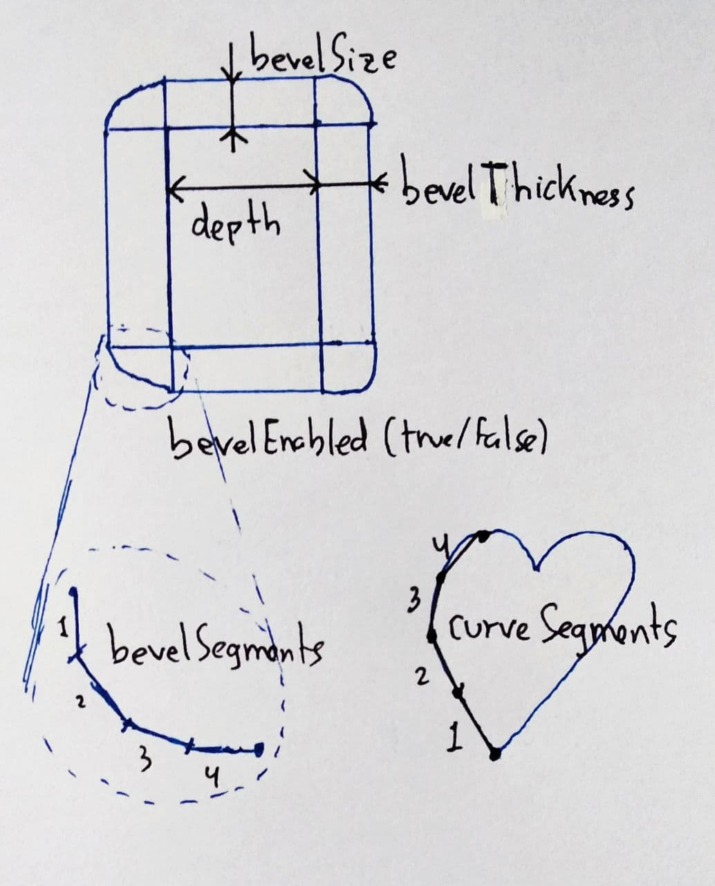
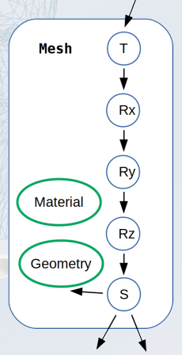

# Funciones SG

## Creación de geometría

### Creación manual y procedural

```javascript
PolyhedronGeometry(vertices, indices)
// vertices e indices son arrays, donde cada 3 valores son, respectivamente,
// un vértice y un triángulo
```

### Shape

Todos los siguientes son métodos de la clase `Shape`.

Para dibujar el contorno:

* `moveTo (x,y)` : Movimiento sin dibujar hasta la posición (x,y)
* `lineTo (x,y)` : Línea recta desde la posición actual hasta la posición (x,y)
* `quadraticCurveTo (aCPx,aCPy,x,y)` : Bezier cuadrática
* `bezierCurveTo (aCPx1,aCPy1,aCPx2,aCPy2,x,y)` : Bezier cúbica, indicando 2 puntos.
* `splineThru (pts)` : Spline por los puntos indicados (`pts` es un array de `THREE.Vector2`)

Contornos cerrados con una sola orden:

* `absarc (x,y, radius, aStartAngle, aEndAngle) `: Dibuja un segmento de círculo.
* `absellipse(x,y, xRadius, yRadius, aStartAngle, aEndAngle) `: Dibuja un segmento de elipse.

Para hacer agujeros se crean shapes de los agujeros y se añaden con `holes.push(unShape)`

```javascript
var shape = new THREE.Shape();
// Se crea el shape con las funciones de arriba
// No olvidar volver al punto del que se ha salido, 
// no sé si es importante pero por si acaso

// Agujeros
var agujero = new THREE.Shape();
// Se crea el shape del agujero
shape.holes.push(agujero);
```

A partir de un Shape:

* Geometría 2D: `var geo = new THREE.ShapeGeometry(unShape);`
* Geometría 3D: `var geo = ExtrudeBufferGeometry(unShape, unasOpciones);`

### Geometría por extrusión y barrido



### Geometría por revolución

```javascript
var geo = new THREE.LatheBufferGeometry(points, segments, phiStart, phiLength);
// points es un array de THREE.Vector2 que constituye el perfil
// segments es la resolución
// phiStart el ángulo en radianes donde comienza la revolución
// phiLength la cantidad de radianes a girar el perfil

// Por defecto, segments=12, phiStart=0, phiLength=2*Math.Pi

// CUIDADO!! phiLenth no siempre es el ángulo final, si lo es cuando phiStart==0

var miMaterial = new THREE.MeshNormalMaterial();
// NOTE Si dejamos el sólido abierto por arriba, no se va a ver
// nada por dentro del objeto, la forma de solucionarlo es o bien
// crear más vértices en el perfil para que haya otro "exterior"
// o bien asignando THREE.DoubleSide al atributo .side del material
// las otras opciones son THREE.Front o THREE.Back
miMaterial.side = THREE.DoubleSide;
```

### Primitivas Básicas

* Caja:

  ```javascript
  var caja = new THREE.BoxBufferGeometry (width, height, depth,
  	widthSegments, heightSegments, depthSegments);
  ```

* Esfera:

  ```javascript
  var esfera = new THREE.SphereBufferGeometry (radius, 
      widthSegments, heightSegments,
  	phiStart, phiLength, thetaStart, thetaLenght);
  ```

* Cilindro:

  ```javascript
  var cilindro = new THREE.CylinderBufferGeometry (radiusTop, radiusBottom, height,
  	segmentsX, segmentsY, openEnded);
  
  // Con el cilindro se pueden hacer también conos o conos truncados
  ```

* Toro:

  ```javascript
  var toro = new THREE.TorusBufferGeometry (radius, tube, radialSegments, tubularSegments, arc);
  ```

Se crean con el origen de coordenadas en el centro

### Poliedros regulares:

```javascript
TetrahedronBufferGeometry, OctahedronBufferGeometry,
IcosahedronBufferGeometry, DodecahedronBufferGeometry
// radius : El radio de la figura. Por defecto, 1
```

### Operaciones booleanas

* **IMPORTANTE**: 

  ```javascript
  import { ThreeBSP } from '../libs/ThreeBSP.js'
  ```

1. Se crean las geometrías **usando las versiones de las clases que <u>NO</u> incluyan la palabra Buffer en su nombre**. Las geometrías deben estar **CERRADAS**.

2. Se posicionan y orientan usando los métodos (de las geometrías):

   ```javascript
   translate (x,y,z), scale (x,y,z), rotateX (angulo), rotateY (angulo), rotateZ (angulo)
   // Estas funciones pueden venir bien para modelos jerárquicos
   // Estas trnaformaciones se aplican a la geometría en el mismo orden que se escriben en el código.
   ```

3. Se transforman a nodos ThreeBSP:

   ```javascript
   var geoBSP = new ThreeBSP ( unaGeometria ) ;
   ```

4. Se opera con nodos BSP, el resultado es otro nodoBSP

   ```javascript
   var result = geoBSP.union(otraBSP)
   				   .intersect(otraBSPmas)
   				   .subtract(unaUltimaBSP)
   
   // union, intersect, subtract
   ```

5. Una vez tenemos un objeto BSP del resultado final, se transforma en una `Geometry`, en una `BufferGeometry` y en un `Mesh`.

   ```javascript
   var geometry       = finalResult.toGeometry();
   var bufferGeometry = new THREE.BufferGeometry().fromGeometry( geometry ) ;
   var result         = new THREE.Mesh( bufferGeometry , material ) ;
   ```


**Plantilla:**

```javascript
//Importamos la biblioteca
import { ThreeBSP } from '../libs/ThreeBSP.js'

// ____________________________________________________________________________

// Se crean las geometrias:
var geo = new THREE.xxxxGeometry(...);
// ...

// Se posicionan y orientan
// Las funciones son translate (x,y,z), scale (x,y,z), rotateX (angulo), rotateY (angulo), rotateZ (angulo)

// Se construyen nodos BSP
var geoBSP = new ThreeBSP(geo);
// ...

// Se construye el árbol binario con las operaciones
// Las funciones son union, intersect y subtract

// Se transforma el resultado en una Geometry, en una BufferGeometry y en un Mesh
var geometry       = finalResult.toGeometry();
var bufferGeometry = new THREE.BufferGeometry().fromGeometry( geometry ) ;
var result         = new THREE.Mesh( bufferGeometry , material ) ;
```

### Geometría eficiente

Importante, si no se usan clases `*BufferGeometry` transformarlas para usar geometría en GPU:

```javascript
var geometriaGPU = new THREE.BufferGeometry().fromGeometry(geometriaCPU);
```

### Construcción de un Mesh

```javascript
// A lo rápido:
var material  = new THREE.MeshNormalMaterial();
var geometria = // ...;
var objeto    = new THREE.Mesh(geometria, material);

this.add(objeto);

// ____________________________________________________________________________

// Con color y todo:
var material = new THREE.MeshPhongMaterial(
	{
        color: 0xFF0000,
        // ...
    }
);
// Transparencia?
material.transparent = true;
material.opacity     = 0.3;

var geometria = // ...;
var objeto    = new THREE.Mesh(geometria, material);

this.add(objeto);
```

### Carga de modelos `.obj`

* **IMPORTANTE**: 

  ```javascript
  import { MTLLoader } from '../libs/MTLLoader.js'
  import { OBJLoader } from '../libs/OBJLoader.js'
  ```

**Plantilla**: (Está en `Ejercicio6/geometriaFichero.js`)

```javascript
class geometriaFichero extends THREE.Mesh{

    constructor(mtlFile, objFile){
        super();

        var that = this;
        var materialLoader = new MTLLoader();
        var objectLoader   = new OBJLoader();
        materialLoader.load(mtlFile,
            function(materials){
                objectLoader.setMaterials(materials);
                objectLoader.load(objFile,
                    function(object){
                        var modelo = object;
                        that.add(modelo);
                    },
                    null, null);
            }
        );
    }

    update(){}
}
```

Si te deja el profe:
```javascript
import { geometriaFichero } from './Ejercicio6/geometriaFichero.js'
```

### Modelos jerárquicos

#### Transformaciones aplicadas a una `Geometry`:

Cadena de nodos de transformación:

* Sin ramificaciones
* Que no dependen de variables
* Terminan en una geometría

```javascript
translate (x,y,z), scale (x,y,z), rotateX (angulo), rotateY (angulo), rotateZ (angulo)
```

(Se aplican en el mismo orden en el que se invocan)

#### Transformaciones en un `Mesh`:

Atributos `position`, `rotation` y `scale`, `.x, .y, .z` para aplicar a una única coordenada o `.set(x,y,z)` para las tres a la vez. **Importante el orden!!**



#### Nodos internos

Se usa **`THREE.Object3D`** (`Mesh` deriva de `Object3D`).

* **Atributos**:
  * `name` : Un nombre, opcional y no necesariamente único
  * `parent` : Referencia a su nodo padre, solo uno
  * `children` : Un array de hijos
  * `position`, `scale` y `rotation`.
* **Métodos**:
  * `add (object)` : Se añade object como hijo
  * `remove (object)` : Se elimina object como hijo
  * `getObjectByName (string)` : Devuelve el objeto con dicho nombre.
  * `translateOnAxis (dirección, distancia)`: Se traslada el Mesh una distancia en una dirección concreta con respecto a su orientación inicial. `dirección` es un `Vector3` que debe estar **normalizado**. Es **acumulativo** a lo que ya tenga `position`.
  * `rotateOnAxis (eje, ángulo)`: Se rota el Mesh un ángulo respecto a un eje concreto. `eje` es un `Vector3` que debe estar **normalizado**. Es **acumulativo** a lo que ya tenga `rotation`.

## Animación

### Velocidad independiente del ordenador

Código extraído del ejercicio 8 de la práctica 1:

```javascript
// En el constructor:
constructor(){   
   	this.velocidad = 1;
    
    // Creación de geometría
    
	this.tiempoAnterior = Date.now(); 
}


// _________________________________________________
// En update:
update(){
    // ...
    var tiempoActual = Date.now();
    var segundos     = (tiempoActual-this.tiempoAnterior)/1000;
    
    this.aguja.rotation.y += (2.0*Math.PI)/12*this.velocidad*segundos;
	this.tiempoAnterior   = tiempoActual;
}
```

### Animación mediante escenas clave

* **IMPORTANTE**:

  ```javascript
  import * as TWEEN from '../libs/tween.esm.js'
  ```

1. Crear diccionarios origen y destino

2. Crear objeto `TWEEN.Tween` fijando los diversos parámetros de la animación:

   * `new TWEEN.tween(origen).to(destino, n*1000)` donde `n` es el número de segundos que queremos que dure la animación.

   * `.easing(...)`: Control de la velocidad, puede tomar valores:

     `TWEEN.Easing.(Linear|Quadratic|Cubic|Quintic|Exponential|Back|Elastic|Bounce).(None|In|Out|InOut)` (`Back`: con retroceso, `Elastic`: Elástico, `Bounce`: Rebote)

   * `.repeat(n|Infinity)`: Número de veces que se repite la animación.

   * `.yoyo(true|false)`: Movimiento de vaivén.

   * `.onStart(function(){...})`: Acciones a realizar antes de empezar la animación.

   * `.onComplete(function(){...})`: Acciones a realizar después de acabar la animación.

   * `.chain(unaAnimacion)`: Encadenar otra animación.

   * `.start(), .pause(), .resume(), .stop()`: Comienzo, pausa, continuación y detención. 

   * `onUpdate(function(){...})`: Acciones a realizar DURANTE la animación.

3. En `update` actualizar el `update` de Tween.

**Plantilla**:

```javascript
// En la cabecera:
import * as TWEEN from '../libs/tween.esm.js'

// ________________________________________________________________________
// En algún método o en el constructor:

// Creamos los diccionarios origen y destino
var origen  = {x: 0, y: 0},
    destino = {x: 1, y: 1};

var time = //Segundos que dura la animación

var that = this;

var animacion = new TWEEN.Tween(origen)
	.to(destino, time*1000)
	.easing(TWEEN.Easing.xxxx.xxxx)
	.repeat(n|Infinity)
	.yoyo(true|false)
	.onStart(
        function(){
            //...
        }
    )
	.onComplete(
        function(){
            //...
        }
    )
	.onUpdate(
        function(){
            // USA EL THAT
            //... Aquí se usa origen.x, origen.y para hacer cosas
        }
    );

// Encadenamos animaciones
animacion.chain(otraAnimacion);

// Comenzamos la animacion
animacion.start();

// _________________________________________________________________________
// En update:
update () {        
    TWEEN.update();
}
```

### Animación mediante caminos

Definimos la trayectoria:

```javascript
createSpline(){
    // Definimos los puntos de paso
    var pts = [...];
    
    var spline = new THREE.CatmullRomCurve3(pts);
    
    // Si se desea visualizar la línea:
    var geometryLine          = new THREE.Geometry();
    geometryLine.vertices     = spline.getPoints(100);
    var material              = new THREE.LineBasicMaterial({color: 0xff0000});
    var visibleSpline         = new THREE.Line(geometryLine, material);
    this.add(visibleSpline);
    
    return spline;
}
```

Definir la posición y la dirección tangente:

```javascript
// Tú suponte que t es un número entre 0 y 1 que varía en el tiempo
var posicion = this.spline.getPointAt(t);
this.object.position.copy(posicion);

var tangente = this.spline.getTangentAt(t);
posicion.add(tangente);

this.object.lookAt(posicion);
```

